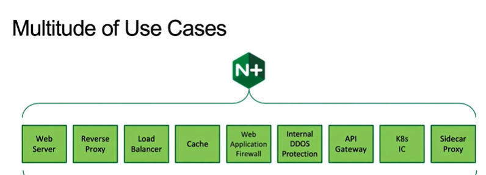
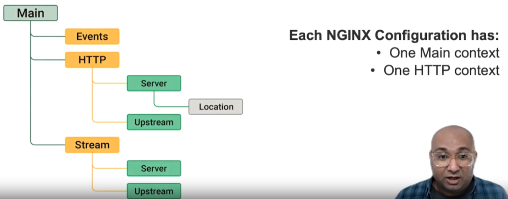

> 이 트레이닝 영상에서는 NGINX Conf 파일의 설정이 어떻게 구성되는지, conf 파일과 생성 방법을 분석하여 원하는 결과를 얻는 방법을 다룹니다.

- 기본 NGINX 명령 실행
- NGINX 구성 찾기
- Context 및 Block 역할의 이해



# 기본 Nginx 명령

```bash
# nginx 버전
nginx -v

#구문의 유효성 검사
nginx -t
# nginx 인스턴스에 구현된 구성 보여주기
nginx -T
# nginx 리로드
nginx -s reload
```

# Nginx 구성

> Configuration 파일의 위치

- configuration -> 설정 파일이라 생각하자 , 아래 2종류로 구성되어있다.
- Main File (기본 디렉토리 파일)
  - /etc/nginx/nginx.conf
- Includes (인스턴스 구성을 위한 설정 파일)
  - /etc/nginx/conf.d/\*.conf
  - nginx 파일의 include 지시문을 통해 구성

## Configuration Contexts



- 각각의 Nginx Configuration은 하나의 Main, Http를 포함한다.
- Events, Http, Stream은 기본 또는 최상위 컨텍스트

### Context

> Nginx 구성 파일 내에서 `설정 블록`을 정의함 → 설정 블록을 그룹화 하고 범위를 지정하는데 사용한다.

**`설정 블록` :** 특정 작업이나 위치에 대한 설정을 그룹화하는데 사용

- 주로 중괄호{} 로 둘러 쌓인 영역을 말한다.
- ex) http, server, location 등
- http : 전체 서버의 설정 관리 컨텍스트
- server : 개별 서버 블록의 설정 관리
- location : 특정 URL경로의 설정을 관리

### Directive

> 설정 블록 내에서 실제 설정을 정의하는데 사용 , 설정 옵션의 이름과 값을 포함한다. →실제 옵션을 정의하고 구체적인 동작 지정

- ex) server_name , root, proxy_pass 등

# Context 및 Block 역할

## Main Context

- 구성 Worker 프로세스 수, Linux 사용자명, 구성 파일의 위치, 로그파일 경로 등 directives 선언한다.

## ㄴ Events

- 각 Worker 프로세스에 할당된 작업 프로세스 당 Connection 수를 관리한다.

## ㄴ Http

- Http, Https연결 처리하는 방법 정의
- 지시어들이 Server,Server의 자식 Location, Upstream 에 상속된다.

### ㄴ Server

> Virtual Hosting을 위한 Virtual Server를 정의

- Domain 이름
- Ip address
- Unix socket

→ 특정 도메인 ,Ip 주소와 연관되며 해당 도메인으로 들어오는 요청 처리

→ Nginx가 여러개의 독립적인 웹사이트 또는 어플리케이션을 단일 물리적 서버에서 **`호스팅`**하는데 사용할 수 있다. → 하나의 도메인으로 여러 어플리케이션 서비스 운영하게 해줌.

- **`호스트` :** 네트워크에 연결된 하나의 컴퓨터
- **`호스팅` :** 서버의 전체 혹은 일부를 이요할 수 있도록 임대해주는 서비스
  - 웹 호스팅: 여러 고객이 하나의 서버를 함께 사용하는 형태
  - 서버 호스팅 : 고객이 단독 서버를 사용

### ㄴㄴ location

> 웹사이트의 특정 URL 기반으로 설정해 해당 요청을 어떻게 처리할 지 지정하는 블럭

- 정의 된 특정경로로 라우팅
- 리다이렉션
- 인증 및 보안
- 캐싱 및 캐시 헤더 설정 가능 등등

### ㄴ Upstream

- 로드 밸런싱에 사용됨

## Stream

> TCP ,UDP같은 트래픽 처리

## Block

> Context속 지시어 묶음, {}로 감싸져 있음

# 주의

- Nginx의 include 매개변수에 포함된 구성을 알파벳 순서로 읽기 때문에 실행순서에 유의해야한다.
