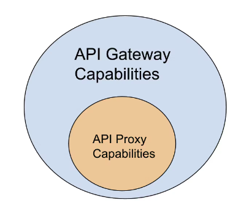

[NGINX를 Reverse Proxy로 설정하기](https://nginxstore.com/training/nginx를-reverse-proxy-설정하기/)

이 트레이닝 영상에서는 NGINX Reverse Proxy는 NGINX 인스턴스에 대해 가장 널리 배포된 사용 사례 중 하나이며 클라이언트와 서버 간의 원활한 네트워크 트래픽 흐름을 보장하기 위해 추가 수준의 추상화 및 제어를 제공합니다.

- Forward Proxy 및 Reverse Proxy에 대한 높은 수준의 이해
- proxy_pass 지시문
- 요청 헤더 재정의

# 리버스 프록시

- 프록시는 리버스 + 포워드를 합쳐 프록시 서버 → 프록시 서버의 위치가 앞단인지 뒷단인지가 중요

## 리버스 프록시란?

> 클라이언트와 백엔드 서버 사이에서 중계역할을 하는 네트워크 기술

- 서버 지향: 클라이언트의 요청을 받아 백엔드 서버로 중계하고 백엔드 서버의 응답을 클라이언트에게 제공하는역할.

## Vs 포워드 프록시?

> 클라이언트의 요청을 중계해 인터넷 서버로 전달하는 역할

<aside>
💡 리버스 프록시에서의 로드밸런싱과 API 게이트웨이에서의 로드밸런싱은 트래픽을 여러 백엔드 서버로 분산시키는 공통점을 가지고 있으나 API게이트웨이는 주로 API 서버간의 트래픽 분산에 이용되며 리버스 프록시는 웹서비스 및 어플리케이션 가용성과 성능향상시키는데 사용

</aside>

# 프록시 vs 게이트웨이

[Kong Inc.](https://konghq.com/blog/engineering/api-gateway-vs-api-proxy-understanding-the-differences)



<aside>
💡 API proxy가 하는 역할 모두 API GateWay가 수행가능하다.

</aside>

## API 프록시 사용 사례

- 요청 포워딩
- 보안
- 캐싱
- 로드 밸런싱
- SSL 인증

## API GateWay는 ?

- 더 나아가 API 라이프 싸이클 관리
- 향상된 보안

## Reverse 프록시

- 로드 밸런싱
- SSL/TLS 인증
- content 압축
- 캐싱
- 보안

## API 게이트웨이 vs 리버스 프록시

<aside>
💡 API 게이트웨이는 API에 대한 중계 , 리버스 프록시는 웹 어플리케이션에 대한 중계 역할 → API게이트웨이는 API 관리에 특화되어있음

</aside>

# proxy_pass Directive

> 문법 : proxy_pass <목적지>

- 일반적으로 server / location context에서 사용됨

# 요청 재정의

- nginx는 기본적으로 백엔드에 가기전 연결을 닫고 백엔드에 보내기 위해 새롭게 연결함 → 이 과정에서 요청 손실될 수 있음
- 따라서 Original 클라이언트의 실제 IP 주소, 호스트 주소와 같은 정보를 담아서 보내줌

```bash
server {
	listen 80;
	proxy_set_header Host $Host ; #host 헤더 담기
	proxy_set_header X-Real-IP $remote_addr ; # 요청자의 원래 아이피
	proxy_set_header X-Forwarded-For $proxy_add_x_forwarded_for;
#해당 서버 까지 전송하기 위해 거쳐가는 모든 IP정보
}
```
