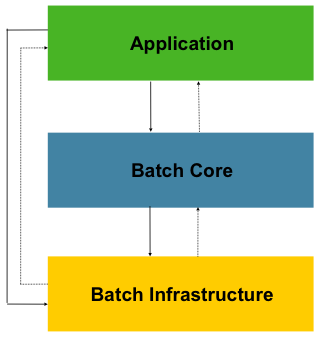

# Spring Batch Architecture

스프링 배치는 확장성과 다양한 사용자 유형을 고려해 설계되었다.
아래는 최종 사용자인 **개발자를 위해 편의성과 확장성을 지원**하는 계층화된 아키텍처를 보여준다.

  

이 아키텍처는 세 가지 주요 구성 요소인 애플리케이션, 코어, 배치 인프라스트럭처를 강조한다.

- **애플리케이션**: 개발자가 Spring Batch를 사용하여 작성한 코드를 포함한다. 즉, 실제로 수행할 작업을 정의하는 곳.
- **배치 코어**: 배치 작업을 실행하고 제어하는 데 필요한 핵심 런타임 클래스(JobLauncher, Job, Step에 대한 구현)을 포함한다. 이 구성 요소는 배치 작업의 실행을 관리하는 역할을 한다.

→ **애플리케이션과 코어는 모두 인프라스트럭쳐 위에서 구축된다.**

- **배치 인프라스트럭처**: 애플리케이션 개발자가 사용하는 것뿐만 아니라 코어 프레임워크 자체에서도 사용되는 ItemReader와 ItemWriter, RetryTemplate과 같은 서비스가 포함되어 있다.

## **일반적인 배치 전략과 가이드라인 (General Batch Principles and Guidelines)**

> 배치 솔류션은 아래의 핵심 원칙, 가이드라인 , 그외의 사항들을 고려해 개발해야 한다.

- 배치 아키텍처는 보통 온라인 아키텍처에 영향을 주고 , 반대도 마찬가지 이다.
  가능하면 공통 구성 요소를 활용하고 아키텍처와 환경을 모두 고려해 설계해라
- 단일 배치 애플리케이션은 가능한 단순화 하고 복잡한 로직은 피해라
- 데이터를 처리하는 곳에 데이터를 저장해라
- 1️⃣ **시스템 리소스 특히 I/O를 최소화해라.** 내부 메모리에서 가능한 많은 연산을 실행해라.
- 불필요한 물리적 I/O를 줄이기 위해 SQL구문을 분석해라
  - 한 번 읽고 캐시나 작업 스토리지에 저장해도 되는 데이터를 매 트랜잭션 때 마다 읽는 경우
  - 같은 트랜잭션 내에서 이미 읽은 데이터를 다시 읽는 경우
  - 불필요한 테이블 스캔이나 인덱스 스캔을 유발하는 경우
  - SQL구문에서 Where절에 키를 지정하지 않는 경우
- **배치 실행에서 같은 작업을 두번하지 마라**
  - ex) 2️⃣ 보고 목적으로 데이터를 요약하는 애플리케이션이라면 데이터를 처음 처리할 때 이미 저장되어있는 값을 업데이트 하여 같은 데이터를 다시 처리하지 않게 해라
- 실행 중에 재할당에 시간을 쏟지 않게 배치 애플리케이션 시작시 충분한 메모리를 할당해라
- 데이터 무결성은 최악의 상황을 고려하여 적절한 유효성 검증 로직을 추가해라
- 3️⃣ 가능한 곳에 내부 검증을 위한 체크섬을 구현해라
  - 4️⃣ flat 파일은 파일의 총 레코드 수와 주요 필드의 집계 결과를 알 수 있는 트레일러 레코드가 필요하다.
- 실제 운영 환경과 그에 맞는 데이터 볼륨을 가지고 가능한 빨리 부하 테스트를 계획하고 실행해라.
- 무중단배포 서버진행시 배치 규모가 크면 백업이 어려울 수 있다. 하지만 데이터베이스 백업만큼 파일 백업도 중요하기 때문에 시스템이 flat파일을 사용한다면 파일 백업 절차를 수립하고 문서화하고 정기적으로 테스트해야한다.
   
   

---

 

**❓) 의문 정리**

1️⃣ : 예를 들어 여러 개의 데이터를 한 번에 읽어와 메모리에 저장 후 필요한 계산이나 변환 작업을 진행해 한 번만 결과를 DB에 저장하며 I/O를 줄일 수 있다.

- **병렬 처리** : 멀티 스레드를 사용하여 배치 작업을 동시에 실행함으로서 I/O작업을 분산시키고, 전체 처리 시간을 줄일 수 있다.
  - Chunk기반 처리 진행시 각 데이터 청크를 멀티 스레드로 처리하여 I/O 대기시간을 줄일 수 있다.
- **비동기 처리** : 비동기 I/O를 활용하여 데이터를 처리하는 동안 다른 작업을 동시에 수행할 수 있게 한다.
  - 데이터베이스에서 데이터를 읽는 동안 계산 작업(CPU사용) 진행시 I/O 대기 시간을 최소화 할 수 있다.
- **배치 크기 조정** : 배치 작업의 크기를 조정하여 각 I/O 호출에서 효율적으로 처리한는 데이터 양을 최적화한다.
  - 너무 작은 배치 사이즈는 잦은 I/O호출을 발생시키고 , 너무 큰 배치사이즈는 메모리 자원을 소모한다.
- **데이터 파이프라인 사용**
  - 아파치 Kafka와 같은 메시지 큐 시스템을 사용하여 데이터를 비동기적으로 처리하고, I/O작업을 분산시킨다. 이를 통해 각 컴포넌트가 독립적으로 작업을 수행할 수 있으며 시스템 자원이 효율적으로 사용된다.
- **Chunk기반 처리** : 데이터를 일정크기(Chunk)로 나누어 한번에 처리해 DB와의 통신을 최소화 할 수 있다.
- **읽기 캐싱** : 데이터를 메모리에 캐싱하여 반복적인 I/O작업을 피한다. ex)
  - ex) ItemReader에서 데이터를 읽은 후 메모리에 저장해 두고, 필요할 때마다 재사용하기.
- DB데이터를 가지고 오는 경우 **필요한 컬럼**만 선택해 불필요한 데이터의 I/O를 줄인다.
- **SQL쿼리를 최적화**하여 불필요한 테이블 스캔을 피한다.

2️⃣ : 쉽게 말하면 처음 계산할때 통계 데이터를 만들어 필요할때 그 값을 업데이트 하여 동일 데이터에 대한 재처리를 방지하자

3️⃣ : 체크섬 : 데이터 무결성 검증을 위해 데이터에서 계산 된값으로 이를 파일에 저장하여 파일이 손상되었는지 확인할 수 있다.

4️⃣ : flat 파일 → 보통 하나의 테이블을 플레인 텍스트 파일로 인코딩한 파일

- 각 데이터 레코드는 한 줄에 저장되어 쉼표,탭,공백과 같은 필드간의 구분자를 사용한다.
- ex) CSV
- 파일의 마지막에 추가되어 집계한 트레일러 레코드를 통해 파일의 손상을 확인할 수 있다.

 
 

## 배치 프로세싱 전략 (**Batch Processing Strategies**)

> 배치 Job 설계를 시작하려면 비즈니스 로직을 다음과 같은 표준 구성 요소를 사용하는 일련의 step으로 나누어야 한다.

### **배치 애플리케이션 기본 구성 요소**

- **변환 애플리케이션: 외부 시스템의 여러 종류의 트랜잭션 레코드를 처리할 때 필요한 표준 형식으로 변환하.**
  - 변환 유틸리티 모듈을 일부/전체를 포함한다.(Basic Batch Service 참조)
- **검증 애플리케이션: 입력 및 출력 레코드의 정확성과 일관성 검증하는 애플리케이션이 필요하다.**
  - 일반적으로 파일 헤더와 트레일러,체크섬,검증 알고리즘, 레코드 레벨 교차 점검을 기반으로 한다.
- **추출 애플리케이션: 외부 DB나 파일에서 데이터를 읽고 미리 설정한 규칙에 맞추어 선택된 레코드를 출력 파일에 저장한다.**
- **추출/업데이트 애플리케이션: 입력 데이터를 기반으로 DB를 업데이트하는 애플리케이션이 필요하다.**
- **처리 및 업데이트 애플리케이션: 검증이나 추출 애플리케이션로부터 받은 입력 트랜잭션에 대한 처리를 진행한다. 보통 DB를 읽어 처리에 필요한 데이터를 얻도, 필요하면 데이터베이스를 수정하고, 출력 처리를 위한 레코드를 만든다.**
- **출력/형식 애플리케이션: 입력 파일을 읽고 표준 형식에 맞추어 레코드를 데이터를 재구성한다. 그리고 다른 프로그램이나 시스템에 출력하거나 전송한다.**

## 배치를 위한 일반적인 처리 옵션

- **오프라인 모드에서 배치 윈도우 동안의 일반 처리**
- **동시 배치 또는 온라인 처리**
- **여러 배치 실행 또는 작업을 동시에 병렬 처리**
- **동일한 작업의 여러 인스턴스를 동시에 처리하는 파티셔닝**
- **앞의 옵션들의 조합**

→ 상업용 스케줄러는 이 옵션 중 일부 혹은 전체를 지원한다.

경험상으로, 배치 처리 옵션마다 채택해야 할 커밋과 잠금(locking)전략이 다르고 무중단 상태의 잠금 전략도 같은 원칙을 사용해야 한다.

### Normal Processing in a **batch window**

> ❓batch window : 특정 시간 동안 데이터나 작업을 모아서 한 번에 처리하는 시간 구간.
>
> - ex)보통 사용자의 이용이 적은 새벽에 진행하는 금융 거래 처리, 데이터 백업 등에 사용된다.

온라인 사용자나 다른 배치 프로세스와는 분리된 간단한 batch window 환경이라면 동시성 문제는 발생하지 않고, 배치 작업이 끝나면 단일 커밋을 수행하면 된다.
하지만 대부분 이보다는 더 견고한 방법을 써야 한다.

대부분의 경우, 보다 견고한 접근 방식이 필요하다. 배치 시스템은 시간이 지남에 따라 복잡성과 데이터 양이 증가하는 경향이 있다. 만약 **잠금 전략(locking strategy)이 없고 시스템이 단일 커밋 지점에 의존한다면, 배치 프로그램을 수정하는 것이 어려울 수 있습니다.**

> ❓단일 커밋 지점에 의존시 모든 데이터 변경이 하나의 트랜잭션으로 묶여 오류 발생시 전체가 롤백되어야 한다. 따라서 특정 부분에 대한 수정도 어려워 복구가 어려워진다.

따라서 가장 간단한 배치 시스템이라고 해도 재시작 , 복구옵션과 관련된 커밋 로직을 고려하는 것이 좋다.

### Concurrent batch or on-line processing

온라인 사용자(서비스를 이용중인 사용자)가 동시에 수정할 수 있는 데이터를 처리하는 배치 애플리케이션은 온라인 사용자에게 필요할 수 있는 데이터에 대해 몇 초 이상 잠금해서는 안 된다.(DB나 파일 모두 포함)

또한, 트랜잭션이 몇 번 끝나면 수정 내역을 DB에 커밋해야 한다. 이를 통해 다른 프로세스에서 사용할 수 업ㄴㅅ는 데이터 양과 데이터를 사용하지 못하는 시간을 최소화 할 수 있다.

물리적 잠금을 최소화 하는 또 다른 방법은 논리적인 row 레벨 잠금을 구현하는 것으로, Optimistic Locking Pattern(낙관적)과 Pessimistic Locking Pattern(비관적)이 있다.

 
 

# 관련 유용한 글

- **카카오 페이 I/O성능 개선**

[Spring Batch 애플리케이션 성능 향상을 위한 주요 팁 | 카카오페이 기술 블로그](https://tech.kakaopay.com/post/spring-batch-performance/#성능-개선-방법-정리)

- **카카오페이 Aggregation을 통한 성능 고려**

[[if kakao 2022] Batch Performance를 고려한 최선의 Aggregation | 카카오페이 기술 블로그](https://tech.kakaopay.com/post/ifkakao2022-batch-performance-aggregation/)

- 플랫 파일?

[플랫 파일 데이터베이스](https://ko.wikipedia.org/wiki/플랫_파일_데이터베이스)
